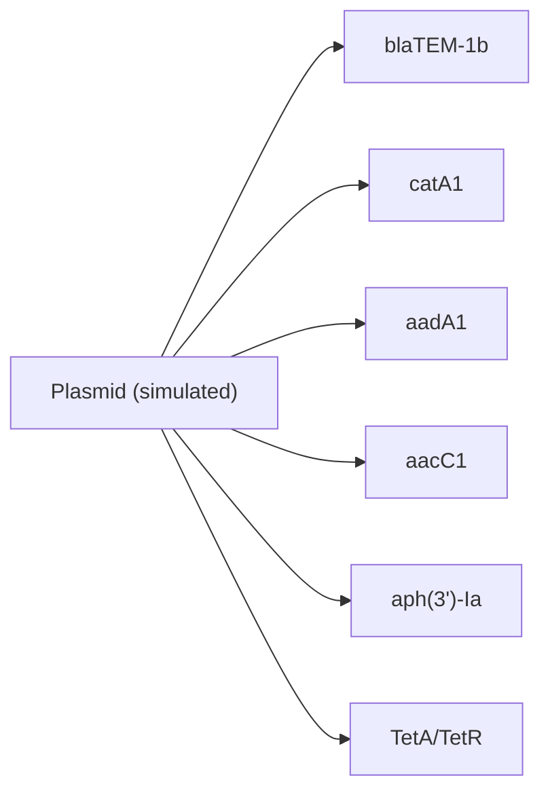

# Illumina_PacBio_Hybrid

## Introduction
This project benchmarks hybrid assembly performance across Illumina short reads and PacBio long reads (CLR and HiFi/CCS). The goal is to simulate controlled bacterial genomes, generate read sets across coverage grids, assemble with Unicycler, and evaluate accuracy/contiguity with QUAST. The resulting summaries let you identify minimum coverage combinations that meet quality thresholds for assembly.

Key goals:
- Simulate repeat‑stress bacterial references for controlled benchmarking
- Compare CLR vs HiFi under identical Illumina coverage
- Quantify assembly quality (N50, errors, genome fraction, misassemblies)
- Produce tables for downstream Pareto/threshold analysis

This repo contains a Mac‑friendly and HPC‑friendly **hybrid simulation → assembly → evaluation** pipeline for bacterial genomes (E. coli–like). It simulates **Illumina PE** reads, **PacBio CLR + HiFi/CCS** reads, runs **Unicycler** hybrid assembly, and evaluates assemblies with **QUAST**.

The scripts are sequentially numbered so you always know what to run first.

## Workspace note (Mac)
Use a path **without spaces** for reliable SPAdes/QUAST runs.
Example:
`/Users/nirwantandukar/Documents/Github/Illumina_PacBio_Hybrid`

## Folder layout
These are created by the scripts as needed:
- `00_ref` reference FASTA
- `01_simref` simulated reference with tandem repeats
- `02_reads` simulated reads
- `03_assemblies` assemblies
- `04_eval` QUAST outputs
- `05_summary` CSV summaries
- `scripts/mac` Mac scripts
- `scripts/hpc` HPC scripts

## Scripts (Mac)
Run in order:
(R version of step 01 is preferred)
1. `scripts/mac/00_setup_conda.sh`
2. `scripts/mac/01_make_tandem_repeats.R` (preferred) or `scripts/mac/01_make_tandem_repeats.py`
3. `scripts/mac/01b_generate_annotations.R` (optional annotations)
4. `scripts/mac/01d_fetch_ref_files.sh` (optional ref downloads)
5. `scripts/mac/02_sim_illumina_art.sh`
6. `scripts/mac/03_sim_pacbio.sh`
7. `scripts/mac/04_run_grid_both_pacbio.sh`
8. `scripts/mac/05_run_unicycler_grid_both.sh`
9. `scripts/mac/06_run_quast_both.sh`
10. `scripts/mac/07_summarize_quast.R`
11. `scripts/mac/08_smoke_test.sh` (optional quick check)
12. `scripts/mac/09_rnaseq_stub.sh` (RNA-seq placeholder)
13. `scripts/mac/10_simulate_gwas_cohort.R` (GWAS cohort simulator)
14. `scripts/mac/11a_generate_random_haplotype_panel.R` (random haplotype panel)
15. `scripts/mac/11_simulate_breeding.R` (breeding simulator)

## Scripts (HPC)
The same logic lives in `scripts/hpc` with identical numbers except the conda setup and smoke test. `scripts/hpc/01d_fetch_ref_files.sh` is also provided.

## Quick start (Mac)
Create a conda env locally in the repo (no global writes):

```bash
scripts/mac/00_setup_conda.sh hybridseq .conda_envs
```

Place a reference genome FASTA at:
`00_ref/ecoli.fa`

Create a repeat‑stress reference:

```bash
scripts/mac/01_make_tandem_repeats.py \
  --in_fa 00_ref/ecoli.fa \
  --out_fa 01_simref/ecoli_repMed.fa \
  --n_events 15 --seg_len 1000 --copies 5 --seed 1
```

Simulate reads (Illumina + CLR + HiFi):

```bash
scripts/mac/04_run_grid_both_pacbio.sh 01_simref/ecoli_repMed.fa ecoli_repMed
```

Assemble hybrid grids:

```bash
scripts/mac/05_run_unicycler_grid_both.sh ecoli_repMed 4
```

Run QUAST:

```bash
scripts/mac/06_run_quast_both.sh ecoli_repMed
```

Summarize:

```bash
scripts/mac/07_summarize_quast.R 04_eval/ecoli_repMed/CLR  05_summary/ecoli_repMed.CLR.quast_summary.csv
scripts/mac/07_summarize_quast.R 04_eval/ecoli_repMed/HIFI 05_summary/ecoli_repMed.HIFI.quast_summary.csv
```


## Reference FASTA panel (optional)
You can download single‑chromosome references into `inst/extdata/ref_files`:

```bash
scripts/mac/01d_fetch_ref_files.sh inst/extdata/ref_files
```

This fetches:
- E. coli K‑12 MG1655 chromosome (NC_000913.3)
- Human GRCh38 chromosome 1 (NC_000001.11)
- Maize B73 RefSeq chromosome 1 (NC_050096.1)

## Optional: Gene Models + TSS + Promoters

Additional options:
- `--rrna_clusters`, `--trna_per_cluster` to add rRNA/tRNA clusters
- `--terminator_prob` to add transcription terminators
- `--add_splicing` (with `--splice_prob`, `--min_exons`, `--max_exons`) to emit exon/intron features
- `--riboswitch_count` to add riboswitch features
- `--crispr_count`, `--crispr_len` to add CRISPR arrays
- `--gc_skew_signal` to add origin/terminus GC-skew features
- `--plasmid_count`, `--plasmid_length`, `--plasmid_gc`, `--plasmid_fa_out` to simulate plasmids
- `--marker_mode`, `--markers_fa`, `--markers_per_plasmid`, `--marker_insert_mode` to add plasmid marker genes
- `--riboswitch_fa`, `--crispr_fa` to output sequences
- `--plasmid_gff3_out` to output plasmid GFF3
Use this if you want a more realistic genome with operons, promoters, and TSS.

Regulatory elements (enhancers/silencers):
- Template: `data/regulatory_panel_template.tsv`
Regulatory panel TSV columns:
- `gene_symbol`, `target_gene_index`, `element_type`, `offset_bp`, `length_bp`
- `gc_target` (optional), `sequence_id` (optional), `notes`

- Use `--regulatory_default_human` to apply the default human panel from `data/regulatory_panel_human.tsv`
- Or provide your own panel with `--regulatory_panel` and optional `--regulatory_fa`

```bash
scripts/mac/01b_generate_annotations.R \
  --genome_fa 01_simref/ecoli_repMed.fa \
  --out_gff3 01_simref/ecoli_repMed.gff3 \
  --genes_fa 01_simref/ecoli_repMed.genes.fa \
  --cds_fa 01_simref/ecoli_repMed.cds.fa \
  --promoters_fa 01_simref/ecoli_repMed.promoters.fa \
  --tss_tsv 01_simref/ecoli_repMed.tss.tsv \
  --operons_tsv 01_simref/ecoli_repMed.operons.tsv
```


## Curated marker panel (optional)
The annotation script can insert antibiotic marker genes on plasmids.
You can use a quick random panel (length-based) or a curated FASTA.

To build the curated FASTA from public accessions:

Default panel in `data/markers_curated.tsv` includes:

Marker panel diagram (example layout):



- `blaTEM-1b` (NC_019368.1:80325-81185)
- `catA1` (V00622)
- `aadA1` (NG_052030.1)
- `aacC1` (X15852.1)
- `aph(3')-Ia` (V00359)
- `TetA/TetR` (J01830)


```bash
scripts/mac/01c_fetch_marker_panel.sh data/markers_curated.tsv data/markers_curated.fa
```

Then enable markers in `01b_generate_annotations.R`:

```bash
scripts/mac/01b_generate_annotations.R   --genome_fa 01_simref/ecoli_repMed.fa   --out_gff3 01_simref/ecoli_repMed.gff3   --plasmid_count 2   --plasmid_fa_out 01_simref/plasmids.fa   --plasmid_gff3_out 01_simref/plasmids.gff3   --marker_mode both   --markers_fa data/markers_curated.fa   --markers_per_plasmid 2   --marker_insert_mode replace
```

## Smoke test (Mac)
A fast, minimal end‑to‑end run:

```bash
scripts/mac/08_smoke_test.sh hybridseq smoke 2 .conda_envs
```


## GWAS cohort simulation (optional)
Simulate a GWAS‑style cohort from a reference genome. This writes:
- VCF (`.vcf`)
- genotype matrix (`.geno.tsv`)
- phenotype table (`.pheno.tsv`)

LD blocks (optional):
- `--ld_block_size` to enable LD blocks (e.g., 50000)
- `--ld_haplotypes` controls LD strength (lower = stronger LD)

Recombination map (optional):
- `--recomb_map_in` use a real recombination map (TSV with pos_bp, cM)
- `--recomb_map_out` writes a synthetic recombination map
- `--recomb_rate_mean` and `--recomb_rate_sd` control cM/Mb rates
- `--recomb_hotspots` and `--recomb_hotspot_mult` add hotspots

Population structure (optional):
- `--n_pops`, `--pop_sizes`, `--fst`, `--pop_effect_shift`
- VCF header now includes per-sample POP labels (##SAMPLE)

Example (diploid, quantitative trait):

```bash
scripts/mac/10_simulate_gwas_cohort.R   --genome_fa inst/extdata/ref_files/human_grch38_chr1.fa   --out_prefix 05_summary/gwas_chr1   --n_samples 200   --ploidy 2   --snp_rate 0.001   --indel_rate 0.0001   --phenotype quantitative   --n_causal 50   --effect_sd 0.6   --seed 7
```

Example (haploid, case/control):

```bash
scripts/mac/10_simulate_gwas_cohort.R   --genome_fa inst/extdata/ref_files/ecoli_k12_mg1655_chr.fa   --out_prefix 05_summary/gwas_ecoli   --n_samples 300   --ploidy 1   --snp_rate 0.002   --indel_rate 0.0002   --phenotype binary   --case_frac 0.5   --n_causal 20   --effect_sd 0.8   --seed 11
```


## Breeding simulation (FASTA haplotype panels)
You can simulate F1, selfing, and backcross populations from a haplotype panel.

Example panel (already created):
- `inst/extdata/ref_files/random_panel.fa`

Generate a new panel:
```bash
scripts/mac/11a_generate_random_haplotype_panel.R   --out_fa inst/extdata/ref_files/random_panel.fa   --n_haps 8 --length 50000 --gc 0.5   --snp_rate 0.002 --indel_rate 0.0002 --indel_maxlen 3   --seed 42
```

Simulate breeding (F1 -> self 2 generations -> backcross to P1):
```bash
scripts/mac/11_simulate_breeding.R   --haplotype_fa inst/extdata/ref_files/random_panel.fa   --out_prefix 05_summary/breeding_demo   --parents hap1,hap2   --sequence F1,SELF:2,BC:P1:1   --n_offspring 100   --seed 7
```

Tokens for `--sequence`:
- `F1[:n]` generate F1 offspring from parents
- `SELF[:n]` self current population n times (default `n_offspring`)
- `BC:P1[:n]` or `BC:P2[:n]` backcross to parent P1 or P2

Outputs:
- `<prefix>.fa` (haplotypes: `sampleX_hap1`, `sampleX_hap2`)
- `<prefix>.meta.tsv` (sample generation + scheme)
- VCF header includes `##SAMPLE` lines with FAMILY labels (NAM)

RIL / NIL / DH shortcuts:
- `--scheme RIL` with `--self_generations` and `--ril_mating SSD|SIB`
- `--scheme NIL` with `--backcross_generations`, `--self_generations`
- `--scheme DH` (doubled haploids)
- `--fix_locus start:end` + `--fix_allele donor|recipient|hapID`


MAGIC example:
```bash
scripts/mac/11_simulate_breeding.R   --haplotype_fa inst/extdata/ref_files/random_panel.fa   --out_prefix 05_summary/magic_demo   --scheme MAGIC   --n_founders 6   --n_offspring 200   --seed 3
```

NAM example:
```bash
scripts/mac/11_simulate_breeding.R   --haplotype_fa inst/extdata/ref_files/random_panel.fa   --out_prefix 05_summary/nam_demo   --scheme NAM   --founders hap1,hap2,hap3,hap4,hap5   --n_offspring 200   --seed 5
```

VCF output from bred lines:
```bash
scripts/mac/11_simulate_breeding.R   --haplotype_fa inst/extdata/ref_files/random_panel.fa   --out_prefix 05_summary/breed_vcf_demo   --sequence F1,SELF:2   --vcf_out 05_summary/breed_vcf_demo.vcf   --seed 9
```


## SimuPOP integration (optional, recommended for complex breeding)
If you want richer mating schemes and population genetics models, use SimuPOP via R + reticulate.

Example:
```bash
conda activate simitall
scripts/mac/12_simupop_api.R --config data/simupop_example.json --out_prefix 05_summary/simupop_demo
```

Config file: `data/simupop_example.json`
SimuPOP bridge from FASTA:
- Add an `init` block in JSON to seed SimuPOP from a haplotype panel FASTA
- `from_fasta`: path to multi‑FASTA panel
- `max_loci`: limit variable sites
- `sample_haplotypes`: sample haplotypes per individual
- `track_hap_ids`: store hap IDs in info fields

Outputs:
- `<prefix>.genotypes.tsv`
- `<prefix>.meta.tsv`
- `<prefix>.vcf` (if `export_vcf: true`)

## Parameter explanations
### 01_make_tandem_repeats.R (preferred) / 01_make_tandem_repeats.py
- `--mode` `tandem|motif|both` (default: `tandem`)
- `--n_events` tandem: number of duplication events
- `--seg_len` tandem: duplicated segment length (bp)
- `--copies` tandem: total copies in tandem (>=2)
- `--motif` motif: repeat string (e.g., `ATTA`)
- `--motif_repeat` motif: repeats per block
- `--motif_events` motif: number of blocks inserted
- `--motif_mode` `insert|replace` (insert grows genome, replace keeps length)
- `--min_spacing` minimum spacing between insertion positions
- `--spacing_distribution` `uniform|poisson|fixed` (controls insertion spacing)
- `--spacing_mean` mean gap (bp) for Poisson spacing
- `--spacing_fixed` fixed interval (bp) for fixed spacing
- `--gc_preserve` attempt to preserve GC by removing GC-matched segments after motif insert
- `--motif_gc_target` generate a random motif with target GC (0-1)
- `--motif_len` length of generated motif when using `--motif_gc_target`
- `--random_genome` generate a random genome instead of using `--in_fa`
- `--random_length` random genome length (bp)
- `--random_gc` random genome GC fraction (0-1)
- `--ploidy` number of copies (default 2)
- `--ploidy_mode` `identical|diverged` (default identical)
- `--ploidy_snp_rate` SNP rate per bp (default 0.001)
- `--ploidy_indel_rate` indel rate per bp (default 0.0001)
- `--ploidy_indel_maxlen` max indel length (bp, default 3)
- `--ploidy_ref_copy` reference copy for coordinates (default 1)
- `--coords_tsv` write TSV of insertion coordinates (includes start/end)
- `--coords_tsv_per_copy` write per-copy TSVs (suffix .copyN)
- `--coords_bed` write BED coordinates for genome browsers
- `--coords_bed_per_copy` write per-copy BEDs (suffix .copyN)
- `--coords_gff3` write GFF3 coordinates
- `--coords_gff3_per_copy` write per-copy GFF3s (suffix .copyN)
- `--summary_json` write JSON summary of parameters + counts
- `--name_map_tsv` write mapping of original name to output name
- `--label_blocks` add block summary to FASTA header
- `--seed` RNG seed


### 01b_generate_annotations.R
Common args:
- `--genome_fa`, `--out_gff3` required
- `--genes_fa`, `--cds_fa`, `--promoters_fa`, `--tss_tsv`, `--operons_tsv` outputs
- `--rrna_clusters`, `--trna_per_cluster`, `--terminator_prob`
- `--add_splicing`, `--splice_prob`, `--min_exons`, `--max_exons`
- `--riboswitch_count`, `--crispr_count`, `--crispr_len`
- `--gc_skew_signal`
- `--plasmid_count`, `--plasmid_length`, `--plasmid_gc`, `--plasmid_fa_out`, `--plasmid_gff3_out`
- `--marker_mode`, `--markers_fa`, `--markers_per_plasmid`, `--marker_insert_mode`

### 02_sim_illumina_art.sh
Arguments:
- `<ref.fa>` reference FASTA
- `<outprefix>` output prefix
- `<cov>` coverage (fold)
- `[readlen]` read length, default 150
- `[ins]` mean insert size, default 350
- `[sd]` insert SD, default 50

### 03_sim_pacbio.sh
Arguments:
- `<ref.fa>` reference FASTA
- `<outdir>` output directory
- `<cov>` coverage (fold)
- `<CLR|HIFI>` read type
- `[seed]` RNG seed

Notes:
- Supports older `pbsim` (no `--data-type`) and uses bundled model files.
- If `pbsim` outputs `.bam`, the script converts to FASTQ using `samtools`.

### 04_run_grid_both_pacbio.sh
Runs a coverage grid for Illumina + PacBio CLR + PacBio HiFi.
Edit the arrays inside the script to change coverage grids.

### 05_run_unicycler_grid_both.sh
Runs Unicycler hybrid assemblies for each Illumina × PacBio pair.
The Mac smoke test uses conservative settings for speed.

### 06_run_quast_both.sh
Runs QUAST against the known simulated reference.
On macOS, this script copies QUAST to a temp path if the environment path contains spaces.

### 07_summarize_quast.R
Aggregates `report.tsv` files into a single CSV.
If some metrics are missing (e.g., minimap2 didn’t compile), values are `NA`.

## Common issues
- **Path with spaces** can break SPAdes/QUAST. Use a no‑spaces path.
- **macOS arm64** can fail to install old QUAST via conda. Use pip install of QUAST.
- **QUAST minimap2 build warnings** in smoke tests are OK; basic stats still work.

## Citation
If you use these tools in a publication, please cite:
- ART
- PBSIM / PBSIM3
- Unicycler
- QUAST


Mermaid crossing graph (optional):
```bash
scripts/mac/11_simulate_breeding.R \
  --haplotype_fa inst/extdata/ref_files/random_panel.fa \
  --out_prefix 05_summary/graph_demo \
  --sequence F1,SELF:2 \
  --graph_out 05_summary/graph_demo.mmd \
  --seed 10
```

Graph rendering (optional):
- `--graph_out` writes a Mermaid `.mmd` graph
- `--graph_format svg|png` attempts to render with `mmdc` if installed


Supported mating schemes in wrapper: RandomMating, RandomSelection, MonogamousMating, PolygamousMating, SelfMating, HermaphroditicMating, ControlledRandomMating, CloneMating, HaplodiploidMating.

SimuPOP presets:
- `"preset": "F1" | "F2" | "NAM" | "MAGIC"` in config JSON


Breeding realism options:
- `--interference_shape` gamma crossover interference (1.0 = Poisson)
- `--genotype_error`, `--missing_rate` for genotyping error/missingness
- `--ascertainment founders|all` for marker ascertainment bias
- `--sv_rate`, `--sv_maxlen` to add simple SV markers in VCF
- `--background_selection`, `--selection_pool`, `--marker_step` for NIL background selection
- `--introgression_target_len` to target donor tract length


Breeding QC reports:
- `--qc_out` writes per-line heterozygosity + breakpoint counts
- `--qc_ld_bins`, `--qc_ld_maxdist` write LD decay bins to `<qc_out>.ld.tsv`

