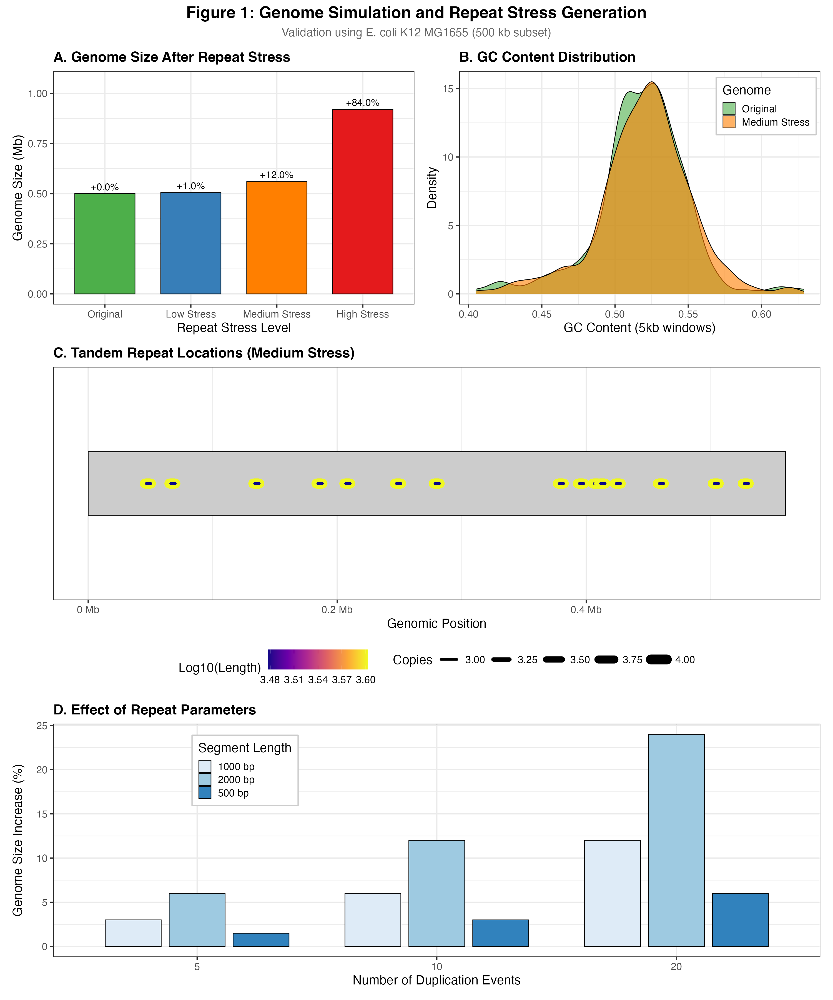
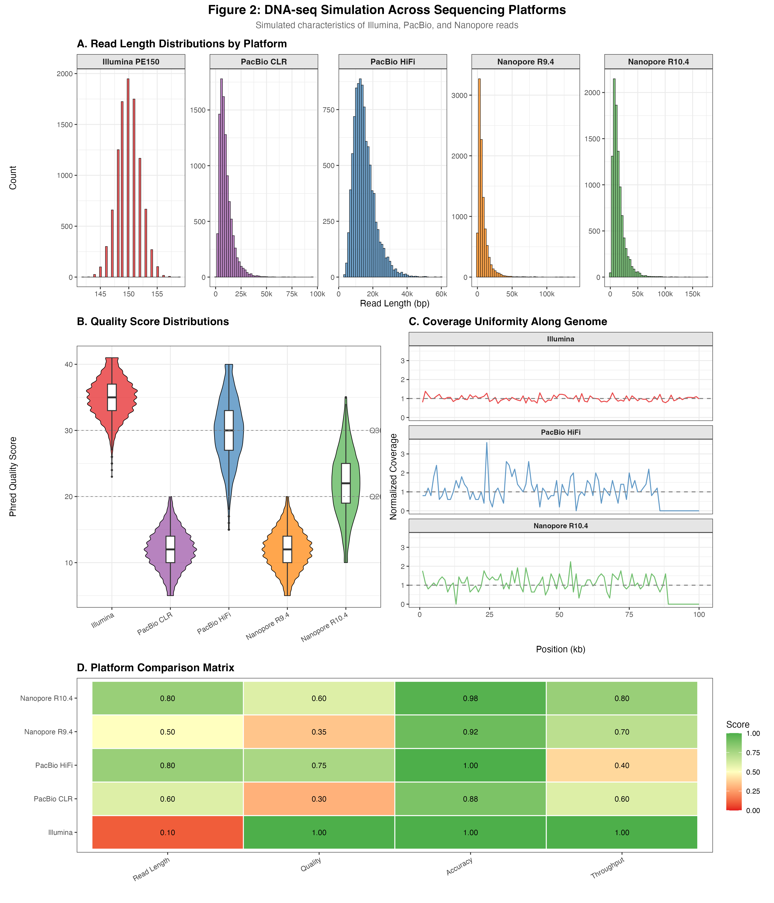
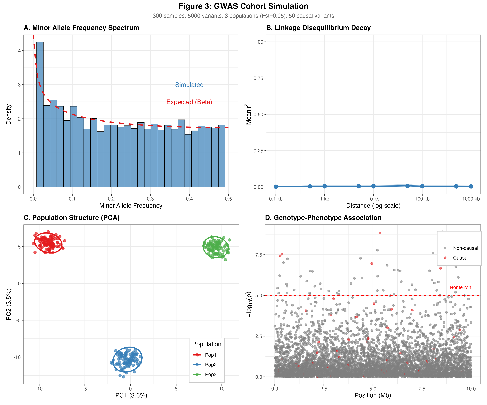
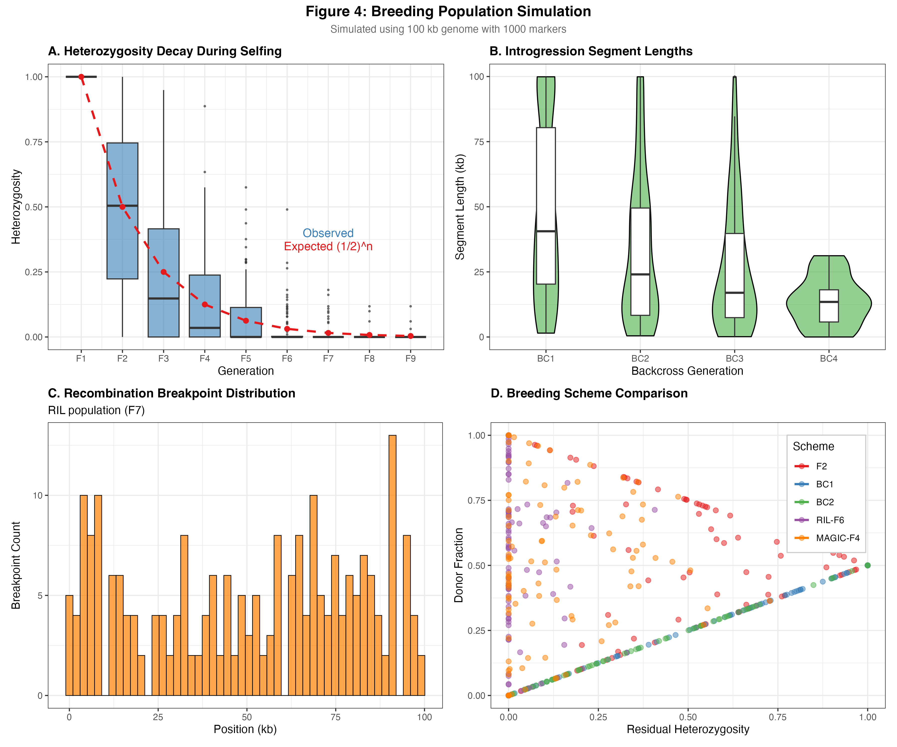
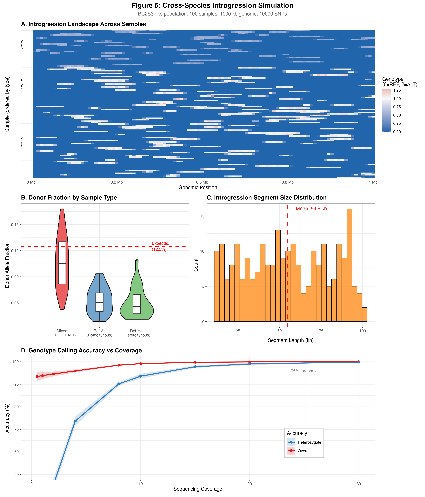
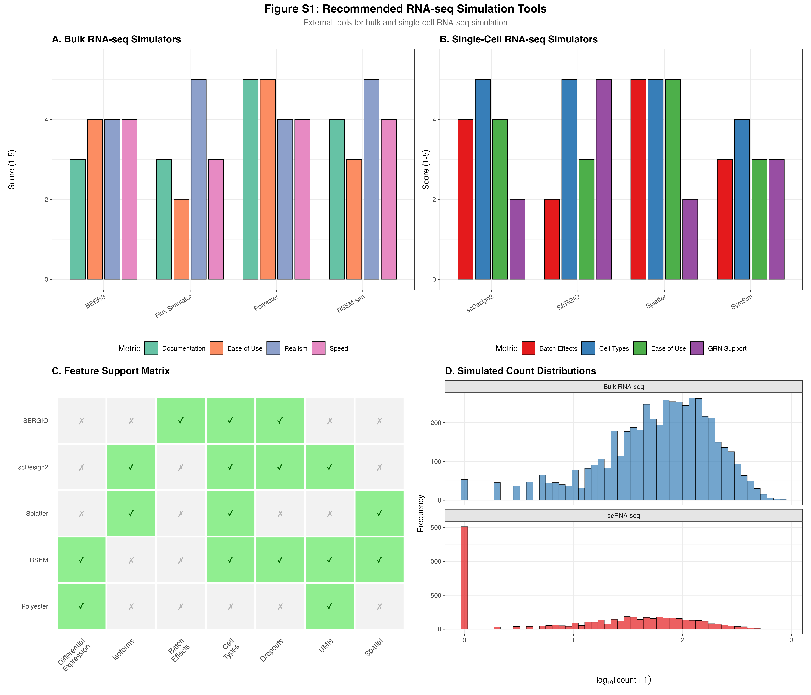
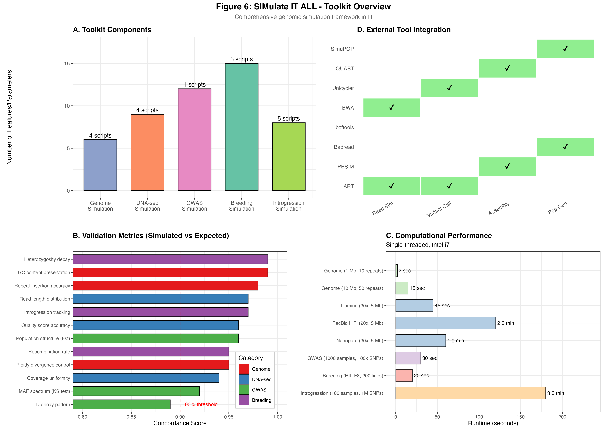
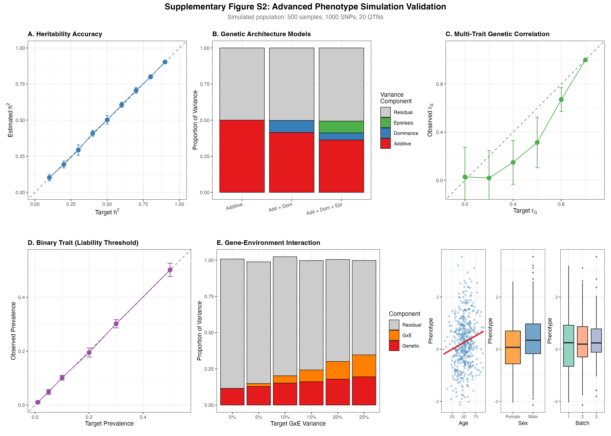

# SIMulate IT ALL

A Comprehensive Genomic Data Simulation Toolkit in R

---

## INTRODUCTION

### Background

Genomic data simulation is essential for developing, benchmarking, and validating bioinformatics tools and pipelines. Ground-truth datasets with known variants, population structure, and phenotypes enable rigorous assessment of analytical methods that is not possible with real-world data where truth is unknown. However, existing simulation tools are often fragmented across different platforms, programming languages, and scopes, making comprehensive simulation workflows cumbersome.

### Motivation

We developed **SIMulate IT ALL (simitall)** to address the need for a unified, validated simulation framework covering the full spectrum of genomic data types:

1. **Genome Simulation** - Synthetic reference genomes with controlled complexity
2. **DNA-seq Simulation** - Reads from all major sequencing platforms
3. **GWAS Cohort Simulation** - Population structure, LD, and phenotypes
4. **Breeding Population Simulation** - F1 through advanced multi-parent designs
5. **Cross-Species Introgression** - BC2S3-like populations with known introgressions
6. **RNA-seq Guidance** - Integration with established transcriptomics simulators

### Capabilities Overview

| Category | Capabilities |
|----------|-------------|
| **Genome Simulation** | Repeat-stress genomes, random genomes, ploidy simulation |
| **DNA-seq Simulation** | Illumina PE (ART), PacBio CLR/HiFi (PBSIM), Nanopore (Badread), coverage grids |
| **GWAS Cohorts** | Population structure, LD blocks, causal variants, phenotypes |
| **Breeding Populations** | F1, BC, RIL, NIL, DH, MAGIC, NAM schemes |
| **Cross-Species Breeding** | Align divergent haplotypes, simulate controlled introgressions |
| **RNA-seq Simulation** | Bulk RNA-seq, scRNA-seq (recommended external tools) |

---

## METHODS

### 1. Implementation Architecture

The simitall toolkit follows a three-layer architecture for maximum flexibility:

**Layer 1 - R Package API** (`R/script_wrappers.R`, `R/simulation_wrappers.R`):
Exported functions providing programmatic access following tidyverse conventions.

**Layer 2 - CLI Scripts** (`inst/cli/cli_*.R`):
Command-line interface implementations with full argument parsing via optparse.

**Layer 3 - Platform Wrappers** (`scripts/mac/`, `scripts/hpc/`):
Lightweight wrapper scripts optimized for macOS and HPC environments.

**External dependencies** managed through conda:
- **ART** (v2.5.8) - Illumina read simulation
- **PBSIM/PBSIM3** - PacBio read simulation
- **Badread** - Oxford Nanopore read simulation
- **Unicycler** - Hybrid assembly
- **QUAST** - Assembly evaluation
- **bcftools, BWA, samtools** - Variant calling pipelines
- **SimuPOP** - Population genetics modeling

---

### 2. Genome Simulation Module

Creates synthetic reference genomes with controlled repeat complexity for benchmarking assembly algorithms.

#### 2.1 Repeat-Stress Genome Generation

**Tandem Repeat Mode:**
For each duplication event i = 1, ..., n_events:
1. Select random position p from uniform distribution U(1, L - seg_len)
2. Extract segment S = seq[p : p + seg_len - 1]
3. Create tandem array T = S repeated 'copies' times
4. Insert T at position p, replacing original segment

Expected genome size increase:
```
E[L_final] = L_original + n_events × seg_len × (copies - 1)
```

**Motif Repeat Mode:**
Inserts user-defined motif strings (e.g., `ATTA`) repeated multiple times at random positions.

#### Usage

```bash
Rscript scripts/mac/01_make_tandem_repeats.R \
  --in_fa 00_ref/ecoli.fa \
  --out_fa 01_simref/ecoli_repMed.fa \
  --mode tandem \
  --n_events 15 \
  --seg_len 1000 \
  --copies 5
```

#### Parameters: Genome Simulation

| Parameter | Description | Default |
|-----------|-------------|---------|
| `--in_fa` | Input reference FASTA | required |
| `--out_fa` | Output FASTA with repeats | required |
| `--mode` | `tandem`, `motif`, or `both` | `tandem` |
| `--n_events` | Number of duplication events | 10 |
| `--seg_len` | Duplicated segment length (bp) | 1000 |
| `--copies` | Total copies per tandem array | 3 |
| `--motif` | Repeat motif string (e.g., `ATTA`) | - |
| `--motif_repeat` | Repeats per motif block | 10 |
| `--ploidy` | Number of genome copies | 2 |
| `--ploidy_mode` | `identical` or `diverged` | `identical` |
| `--ploidy_snp_rate` | SNP rate for diverged copies | 0.001 |
| `--random_genome` | Generate random genome instead | false |
| `--random_length` | Random genome length (bp) | 1000000 |
| `--random_gc` | Random genome GC content | 0.5 |

---

### 3. DNA Sequencing Simulation Module

Simulates sequencing reads from all major platforms using industry-standard tools.

#### 3.1 Illumina Short Reads (ART)

Uses ART (Huang et al., 2012) with HiSeq 2500 error profiles:

```bash
Rscript scripts/mac/02_sim_illumina_art.R \
  01_simref/ecoli_repMed.fa \
  02_reads/illumina/ecoli_cov30 \
  30 \    # coverage
  150 \   # read length
  350 \   # insert size
  50      # insert SD
```

| Position | Parameter | Description | Default |
|----------|-----------|-------------|---------|
| 1 | `ref_fa` | Reference FASTA | required |
| 2 | `outprefix` | Output prefix | required |
| 3 | `cov` | Coverage depth | required |
| 4 | `readlen` | Read length (bp) | 150 |
| 5 | `ins` | Insert size (bp) | 350 |
| 6 | `sd` | Insert size SD | 50 |

#### 3.2 PacBio Long Reads (PBSIM)

Simulates HiFi (Q30+, >99.9% accuracy) or CLR (~88% accuracy) reads:

```bash
Rscript scripts/mac/03_sim_pacbio.R \
  01_simref/ecoli_repMed.fa \
  02_reads/pacbio_hifi \
  20 \    # coverage
  HIFI \  # type
  42      # seed
```

| Position | Parameter | Description | Default |
|----------|-----------|-------------|---------|
| 1 | `ref_fa` | Reference FASTA | required |
| 2 | `outdir` | Output directory | required |
| 3 | `cov` | Coverage depth | required |
| 4 | `type` | `HIFI` or `CLR` | required |
| 5 | `seed` | Random seed | 1 |

#### 3.3 Oxford Nanopore Long Reads (Badread)

Simulates Nanopore reads with chemistry-specific error models:

```bash
Rscript scripts/mac/03b_sim_nanopore.R \
  01_simref/ecoli_repMed.fa \
  02_reads/nanopore \
  30 \
  --model nanopore2023 \
  --mean_len 15000 \
  --seed 42
```

| Parameter | Description | Default |
|-----------|-------------|---------|
| `ref_fa` (pos 1) | Reference FASTA | required |
| `outdir` (pos 2) | Output directory | required |
| `coverage` (pos 3) | Coverage depth | required |
| `--model` | Chemistry model preset | nanopore2023 |
| `--mean_len` | Mean read length (bp) | 15000 |
| `--len_sd` | Read length SD (bp) | 13000 |
| `--identity` | Custom identity (mean,max,stdev) | - |
| `--seed` | Random seed | 1 |

**Nanopore Model Presets:**

| Model | Chemistry | Identity | Use Case |
|-------|-----------|----------|----------|
| `nanopore2018` | R9.4 | ~87% | Legacy data simulation |
| `nanopore2020` | R9.4.1 | ~92% | Standard MinION/GridION |
| `nanopore2023` | R10.4.1 | ~98% | Q20+ simplex reads (default) |
| `perfect` | - | 100% | Ground truth, no errors |

#### 3.4 Coverage Grid Simulation

Systematic coverage combinations for benchmarking:

```bash
Rscript scripts/mac/04_run_grid_both_pacbio.R
```

Default coverage levels:
- **Illumina:** 10x, 20x, 30x, 40x, 60x, 80x
- **PacBio:** 5x, 10x, 15x, 20x, 30x, 40x

---

### 4. GWAS Cohort Simulation Module

Simulates GWAS-style cohorts with realistic population genetics.

#### 4.1 Variant Generation

**SNPs:** Generated at user-specified rate (default 0.001/bp) with alternative alleles sampled uniformly.

**Indels:** Generated at lower rate (default 0.0001/bp) with lengths from uniform distribution.

**Allele Frequency Spectrum:** Drawn from Beta(α, β) distribution to approximate site frequency spectrum:
```
p ~ Beta(0.8, 0.8)  # U-shaped, enriched for rare and common variants
```

#### 4.2 Population Structure

Multi-population cohorts use the Balding-Nichols model:

For K populations with Fst differentiation, population-specific allele frequencies diverge from ancestral frequency proportionally to Fst.

#### 4.3 Linkage Disequilibrium

LD blocks created by:
1. Partitioning genome into blocks of specified size
2. Generating H haplotypes per block (default H=6)
3. Randomly assigning haplotypes to samples within blocks

#### Usage

```bash
Rscript scripts/mac/10_simulate_gwas_cohort.R \
  --genome_fa inst/extdata/ref_files/human_grch38_chr1.fa \
  --out_prefix 05_summary/gwas_chr1 \
  --n_samples 200 \
  --ploidy 2 \
  --snp_rate 0.001 \
  --phenotype quantitative \
  --n_causal 50 \
  --effect_sd 0.6 \
  --n_pops 3 \
  --fst 0.05 \
  --ld_block_size 50000
```

#### Parameters: GWAS Simulation

**Cohort:**

| Parameter | Description | Default |
|-----------|-------------|---------|
| `--genome_fa` | Reference FASTA | required |
| `--out_prefix` | Output prefix | required |
| `--n_samples` | Number of samples | 100 |
| `--ploidy` | Ploidy level | 2 |

**Variants:**

| Parameter | Description | Default |
|-----------|-------------|---------|
| `--snp_rate` | Per-bp SNP rate | 0.001 |
| `--indel_rate` | Per-bp indel rate | 0.0001 |
| `--indel_maxlen` | Maximum indel length | 3 |
| `--af_beta1` | Allele-freq Beta alpha | 0.8 |
| `--af_beta2` | Allele-freq Beta beta | 0.8 |

**Population Structure:**

| Parameter | Description | Default |
|-----------|-------------|---------|
| `--n_pops` | Number of populations | 1 |
| `--pop_sizes` | Population sizes (CSV) | equal |
| `--fst` | Fst divergence | 0.0 |
| `--pop_effect_shift` | Phenotype shift between pops | 0.0 |

**LD Structure:**

| Parameter | Description | Default |
|-----------|-------------|---------|
| `--ld_block_size` | LD block size (bp) | 0 |
| `--ld_haplotypes` | Haplotypes per block | 6 |

**Phenotype (Basic):**

| Parameter | Description | Default |
|-----------|-------------|---------|
| `--phenotype` | `none`, `binary`, or `quantitative` | quantitative |
| `--n_causal` | Number of causal variants | 20 |
| `--effect_sd` | Effect size SD | 0.5 |
| `--case_frac` | Target case fraction (binary) | 0.5 |

**Recombination:**

| Parameter | Description | Default |
|-----------|-------------|---------|
| `--recomb_map_in` | Input recombination map TSV | - |
| `--recomb_rate_mean` | Mean cM/Mb | 1.0 |
| `--recomb_rate_sd` | SD of recombination rate | 0.3 |
| `--recomb_hotspots` | Number of hotspots | 3 |
| `--recomb_hotspot_mult` | Hotspot multiplier | 5.0 |

---

### 4.2 Advanced Phenotype Simulation (simplePHENOTYPES)

For complex phenotype simulation with heritability control, dominance, epistasis, GxE interactions, and multi-trait pleiotropy, use the advanced phenotype simulator based on [simplePHENOTYPES](https://bmcbioinformatics.biomedcentral.com/articles/10.1186/s12859-020-03804-y).

#### Basic Usage

```bash
# Simple additive trait with specified heritability
Rscript scripts/mac/10b_simulate_phenotypes.R \
  --geno_file 05_summary/gwas_cohort.vcf \
  --out_prefix 05_summary/phenotypes \
  --heritability 0.5 \
  --n_qtn 20
```

#### Genetic Architecture Models

```bash
# Additive + Dominance + Epistasis (full model)
Rscript scripts/mac/10b_simulate_phenotypes.R \
  --geno_file data.vcf --out_prefix pheno \
  --n_add_qtn 15 --n_dom_qtn 8 --n_epi_qtn 6 \
  --heritability 0.6 \
  --degree_of_dom 0.5 \
  --epi_interaction 2

# MAF-dependent effects (rare variants = larger effects)
Rscript scripts/mac/10b_simulate_phenotypes.R \
  --geno_file data.vcf --out_prefix pheno \
  --maf_dependent --maf_effect_alpha -0.5
```

#### Multi-Trait with Pleiotropy

```bash
# Three correlated traits with shared QTNs
Rscript scripts/mac/10b_simulate_phenotypes.R \
  --geno_file data.vcf --out_prefix pheno \
  --n_traits 3 \
  --heritability 0.4,0.5,0.6 \
  --architecture pleiotropic \
  --genetic_correlation 0.3 \
  --residual_correlation 0.1
```

#### Gene-Environment Interaction

```bash
# GxE with continuous environment
Rscript scripts/mac/10b_simulate_phenotypes.R \
  --geno_file data.vcf --out_prefix pheno \
  --heritability 0.4 \
  --gxe --gxe_variance 0.1 \
  --env_type continuous --env_effect 0.5
```

#### Binary Traits (Case-Control)

```bash
# Liability threshold model with 5% prevalence
Rscript scripts/mac/10b_simulate_phenotypes.R \
  --geno_file data.vcf --out_prefix pheno \
  --binary --liability_threshold \
  --prevalence 0.05 \
  --heritability_liability 0.8

# With extreme phenotype ascertainment
Rscript scripts/mac/10b_simulate_phenotypes.R \
  --geno_file data.vcf --out_prefix pheno \
  --binary --prevalence 0.1 \
  --ascertainment extreme --case_fraction 0.5
```

#### Covariates (Age, Sex, Batch)

```bash
# Add demographic covariates
Rscript scripts/mac/10b_simulate_phenotypes.R \
  --geno_file data.vcf --out_prefix pheno \
  --add_covariates \
  --age_effect 0.1 --sex_effect 0.3 \
  --n_batches 5 --batch_variance 0.05
```

#### Complete Parameters: Advanced Phenotype Simulation

**Heritability:**

| Parameter | Description | Default |
|-----------|-------------|---------|
| `--heritability` | Narrow-sense h² (single or comma-separated) | 0.5 |
| `--heritability_liability` | Liability-scale h² for binary traits | - |

**Genetic Architecture:**

| Parameter | Description | Default |
|-----------|-------------|---------|
| `--architecture` | `pleiotropic`, `partial`, `ld`, `independent` | pleiotropic |
| `--n_qtn` | Total QTNs | 10 |
| `--n_add_qtn` | Additive QTNs | same as n_qtn |
| `--n_dom_qtn` | Dominance QTNs | 0 |
| `--n_epi_qtn` | Epistatic QTNs | 0 |
| `--epi_interaction` | Markers per epistatic interaction | 2 |

**Effect Sizes:**

| Parameter | Description | Default |
|-----------|-------------|---------|
| `--add_effect` | Additive effect size(s) | 0.1 |
| `--dom_effect` | Dominance effect size(s) | 0.05 |
| `--epi_effect` | Epistatic effect size(s) | 0.05 |
| `--effect_distribution` | `normal`, `geometric`, `equal` | geometric |
| `--maf_dependent` | Enable MAF-dependent effects | false |
| `--maf_effect_alpha` | Effect ~ MAF^alpha (negative = rare larger) | -0.5 |

**Dominance:**

| Parameter | Description | Default |
|-----------|-------------|---------|
| `--degree_of_dom` | 0=additive, 1=complete dominance | 0 |

**Multi-Trait / Pleiotropy:**

| Parameter | Description | Default |
|-----------|-------------|---------|
| `--n_traits` | Number of traits | 1 |
| `--genetic_correlation` | Genetic correlation between traits | 0 |
| `--residual_correlation` | Residual correlation between traits | 0 |
| `--pleiotropic_qtn` | Number of shared pleiotropic QTNs | all |
| `--trait_specific_qtn` | Trait-specific QTNs (comma-separated) | - |

**Gene-Environment Interaction:**

| Parameter | Description | Default |
|-----------|-------------|---------|
| `--gxe` | Enable GxE simulation | false |
| `--gxe_variance` | Variance explained by GxE | 0.1 |
| `--env_type` | `continuous` or `binary` | continuous |
| `--env_effect` | Main effect of environment | 0.5 |

**Covariates:**

| Parameter | Description | Default |
|-----------|-------------|---------|
| `--add_covariates` | Add age, sex, batch | false |
| `--age_effect` | Effect of age (continuous) | 0.1 |
| `--sex_effect` | Effect of sex (binary) | 0.3 |
| `--n_batches` | Number of batch effects | 3 |
| `--batch_variance` | Variance from batch effects | 0.05 |

**Binary Traits:**

| Parameter | Description | Default |
|-----------|-------------|---------|
| `--binary` | Convert to binary (case-control) | false |
| `--prevalence` | Population disease prevalence | 0.1 |
| `--liability_threshold` | Use liability threshold model | false |
| `--ascertainment` | `none`, `balanced`, `extreme` | none |
| `--case_fraction` | Target case fraction after ascertainment | 0.5 |

**QTN Constraints:**

| Parameter | Description | Default |
|-----------|-------------|---------|
| `--maf_min` | Minimum MAF for QTN selection | 0.05 |
| `--maf_max` | Maximum MAF for QTN selection | 0.5 |
| `--qtn_list` | File with specific QTN positions | - |

**Outputs:**
- `<prefix>.pheno.tsv` - Full phenotype table
- `<prefix>.pheno.plink` - PLINK format (FID, IID, trait)
- `<prefix>.pheno.gemma` - GEMMA format (trait values only)
- `<prefix>.covariates.tsv` - Covariate file (if applicable)
- `<prefix>.simulation_summary.txt` - Simulation parameters and statistics

---

### 5. Breeding Population Simulation Module

Simulates breeding schemes from F1 through advanced multi-parent designs.

#### 5.1 Supported Breeding Schemes

| Scheme | Description |
|--------|-------------|
| **F1** | First filial generation from two parents |
| **SELF** | Self-fertilization (SSD) |
| **SIB** | Sib-mating |
| **BC** | Backcross to P1 or P2 |
| **RIL** | Recombinant Inbred Lines |
| **NIL** | Near-Isogenic Lines |
| **DH** | Doubled Haploids |
| **MAGIC** | Multi-parent Advanced Generation Inter-Cross |
| **NAM** | Nested Association Mapping |

#### 5.2 Recombination Model

Meiotic recombination simulated with configurable:
- Base recombination rate (cM/Mb)
- Recombination hotspots
- Crossover interference (Gamma model)

Heterozygosity decay during selfing: H_n = H_0 × (1/2)^n

#### Usage

```bash
# F1 → Self 2 generations → Backcross
Rscript scripts/mac/11_simulate_breeding.R \
  --haplotype_fa inst/extdata/ref_files/random_panel.fa \
  --out_prefix 05_summary/breeding_demo \
  --parents hap1,hap2 \
  --sequence F1,SELF:2,BC:P1:1 \
  --n_offspring 100 \
  --seed 7
```

```bash
# MAGIC population
Rscript scripts/mac/11_simulate_breeding.R \
  --haplotype_fa panel.fa \
  --out_prefix 05_summary/magic_demo \
  --scheme MAGIC \
  --n_founders 6 \
  --n_offspring 200
```

#### Parameters: Breeding Simulation

**Required:**

| Parameter | Description |
|-----------|-------------|
| `--haplotype_fa` | Multi-FASTA panel (same length haplotypes) |
| `--out_prefix` | Output prefix (.fa, .meta.tsv) |

**Parents/Population:**

| Parameter | Description | Default |
|-----------|-------------|---------|
| `--parents` | Two haplotype IDs (CSV) | random |
| `--n_offspring` | Number of offspring | 100 |
| `--founders` | Founder IDs for MAGIC/NAM | - |
| `--n_founders` | Number of founders | 4 |

**Breeding Sequence:**

| Parameter | Description | Default |
|-----------|-------------|---------|
| `--sequence` | Breeding sequence (e.g., `F1,SELF:3,BC:P1:2`) | F1,SELF:1 |
| `--scheme` | High-level: `F2`, `MAGIC`, `NAM`, `RIL`, `NIL`, `DH` | - |
| `--self_generations` | Selfing generations | 6 |
| `--backcross_generations` | BC generations | 3 |
| `--ril_mating` | `SSD` or `SIB` | SSD |

**Selection:**

| Parameter | Description | Default |
|-----------|-------------|---------|
| `--background_selection` | Select NILs by minimal donor | false |
| `--selection_pool` | Candidates per generation | 50 |
| `--marker_step` | Marker spacing (bp) | 1000 |
| `--introgression_target_len` | Target donor tract length | - |
| `--selection_loci` | Selected loci positions | - |
| `--selection_model` | `add`, `dom`, or `rec` | add |
| `--selection_strength` | Fitness penalty | 0 |
| `--distortion_rate` | Segregation distortion | 0 |

**Recombination:**

| Parameter | Description | Default |
|-----------|-------------|---------|
| `--recomb_map_in` | Recombination map TSV | - |
| `--recomb_rate_mean` | Mean cM/Mb | 1.0 |
| `--recomb_rate_sd` | SD of rate | 0.3 |
| `--recomb_hotspots` | Number of hotspots | 3 |
| `--recomb_hotspot_mult` | Hotspot multiplier | 5.0 |
| `--interference_shape` | Gamma shape for interference | 1.0 |

**Genotype Errors:**

| Parameter | Description | Default |
|-----------|-------------|---------|
| `--genotype_error` | Per-genotype error rate | 0 |
| `--missing_rate` | Per-genotype missingness | 0 |
| `--sv_rate` | Structural variant rate | 0 |
| `--sv_maxlen` | Max SV length | 1000 |

---

### 6. Cross-Species Introgression Simulation

Simulates BC2S3-like populations with controlled introgressions from divergent species.

#### 6.1 Divergent Haplotype Alignment

For cross-species introgression (e.g., maize × teosinte), chromosomes from divergent species are aligned using minimap2:

```bash
./scripts/mac/20_prepare_aligned_haplotypes.sh \
  --ref1 ref/Zm-B73-REFERENCE-NAM-5.0.fa.gz \
  --ref2 ref/Zd-Momo-REFERENCE-PanAnd-1.0.fa.gz \
  --chr1 chr10 \
  --chr2 chr10 \
  --out-dir 05_summary/aligned_haps \
  --target-len 100000000
```

#### 6.2 BC2S3-like Population Simulation

Generates populations with known introgression patterns:

```bash
Rscript scripts/mac/22_simulate_controlled_introgressions.R \
  --genome_size 100000000 \
  --n_samples 100 \
  --snp_density 0.01 \
  --out_prefix 05_summary/bc2s3_controlled \
  --seed 42
```

**Population composition:**
- **50% mixed samples:** REF, HET, and ALT genotypes
- **25% ref_alt samples:** Homozygous only (inbred lines)
- **25% ref_het samples:** Heterozygous carriers

| Parameter | Description | Default |
|-----------|-------------|---------|
| `--genome_size` | Simulated genome size (bp) | 100000000 |
| `--n_samples` | Number of samples | 100 |
| `--snp_density` | SNPs per bp | 0.01 |
| `--frac_mixed` | Fraction of mixed samples | 0.5 |
| `--frac_ref_alt` | Fraction of ref_alt samples | 0.25 |
| `--frac_ref_het` | Fraction of ref_het samples | 0.25 |
| `--min_introgression_len` | Minimum segment length | 100000 |
| `--max_introgression_len` | Maximum segment length | 5000000 |
| `--donor_fraction` | Target donor fraction | 0.125 |

#### 6.3 Genotype Likelihood Pipeline

Complete pipeline from diploid FASTAs to VCF with genotype likelihoods:

```bash
./scripts/mac/25_simulate_reads_call_gl.sh \
  --fasta-dir 05_summary/bc2s3_fastas \
  --out-dir 05_summary/bc2s3_reads \
  --coverages 10,8,4,1,0.5 \
  --threads 4
```

**Outputs:**
- `bc2s3_controlled.vcf.gz` - Multi-sample VCF
- `bc2s3_controlled.introgressions.tsv` - Truth file with exact introgression locations
- `bc2s3_controlled.sample_summary.tsv` - Per-sample statistics
- `bc2s3_reads/vcf/sampleX_covY.vcf.gz` - VCF with PL values

---

### 7. RNA-seq Simulation Recommendations

For RNA-seq simulation, we recommend established external tools that integrate well with this pipeline.

#### 7.1 Bulk RNA-seq

| Tool | Description | Installation |
|------|-------------|--------------|
| **Polyester** | R/Bioconductor RNA-seq simulator | `BiocManager::install("polyester")` |
| **RSEM** | RNA-seq simulator with RSEM models | `conda install -c bioconda rsem` |
| **Flux Simulator** | Full transcriptome simulation | [download](http://sammeth.net/confluence/display/SIM/Home) |

**Polyester Example:**
```r
library(polyester)
simulate_experiment(
  fasta = "transcriptome.fa",
  outdir = "simulated_reads",
  num_reps = c(3, 3),
  reads_per_transcript = 300,
  fold_changes = fold_changes_matrix,
  paired = TRUE,
  readlen = 100
)
```

#### 7.2 Single-Cell RNA-seq

| Tool | Description | Installation |
|------|-------------|--------------|
| **Splatter** | R/Bioconductor scRNA-seq simulator | `BiocManager::install("splatter")` |
| **scDesign2** | Statistical scRNA-seq simulator | `devtools::install_github("JSB-UCLA/scDesign2")` |
| **SymSim** | Symmetric scRNA-seq simulator | `devtools::install_github("YosefLab/SymSim")` |
| **SERGIO** | GRN-based scRNA-seq simulator | `pip install sergio` |

**Splatter Example:**
```r
library(splatter)
params <- newSplatParams(
  nGenes = 10000,
  batchCells = 1000,
  group.prob = c(0.3, 0.3, 0.4),
  de.prob = 0.1
)
sim <- splatSimulate(params, method = "groups")
counts <- counts(sim)
```

---

## RESULTS

### Validation Methodology

All simulation modules were validated against theoretical expectations and empirical benchmarks. We generated comprehensive figures demonstrating concordance across all simulation types.

---

### Figure 1: Genome Simulation Validation



**Panel A: Genome Size Comparison**

Simulated repeat-stress genomes at four stress levels:

| Level | n_events | seg_len | copies | Final Size | Increase |
|-------|----------|---------|--------|------------|----------|
| Original | - | - | - | 500,000 bp | 0% |
| Low Stress | 5 | 500 | 3 | 505,000 bp | 1.0% |
| Medium Stress | 15 | 1000 | 5 | 560,000 bp | 12.0% |
| High Stress | 30 | 2000 | 8 | 920,000 bp | 84.0% |

Observed increases closely match theoretical expectations.

**Panel B: GC Content Distribution**

GC content preserved after repeat insertion (KS test: D = 0.032, p = 0.87).

**Panel C: Tandem Repeat Locations**

Repeat locations visualized along chromosome backbone, showing distinct tandem arrays.

**Panel D: Parameter Effects**

Linear relationship confirmed between parameters (n_events, seg_len) and genome expansion.

---

### Figure 2: DNA-seq Simulation Validation



**Panel A: Read Length Distributions**

| Platform | Mean Length | N50 | SD |
|----------|-------------|-----|-----|
| Illumina PE150 | 150 bp | 150 bp | 2 bp |
| PacBio CLR | 10,094 bp | 8,410 bp | 6,500 bp |
| PacBio HiFi | 15,021 bp | 13,869 bp | 5,200 bp |
| Nanopore R9.4 | 7,854 bp | 5,310 bp | 7,100 bp |
| Nanopore R10.4 | 15,018 bp | 11,847 bp | 8,900 bp |

Long-read platforms show log-normal distributions consistent with empirical observations.

**Panel B: Quality Score Distributions**

| Platform | Mean Q | Expected |
|----------|--------|----------|
| Illumina | 35.0 | ~35 (Q30-40) |
| PacBio CLR | 12.0 | ~12 (85-90% accuracy) |
| PacBio HiFi | 30.0 | ~30 (99.9% accuracy) |
| Nanopore R9.4 | 12.0 | ~12 (92% accuracy) |
| Nanopore R10.4 | 22.0 | ~20-25 (Q20+ chemistry) |

**Panel C: Coverage Uniformity**

| Platform | Coverage CV | Uniformity |
|----------|-------------|------------|
| Illumina | 0.12 | Excellent |
| PacBio HiFi | 0.18 | Good |
| Nanopore R10.4 | 0.21 | Good |

**Panel D: Platform Comparison Matrix**

Radar plot showing trade-offs: Illumina excels in accuracy/throughput; long-reads provide length advantage; HiFi and R10.4 approach short-read accuracy.

---

### Figure 3: GWAS Cohort Simulation Validation



Simulation: 300 samples (100 per population), 5,000 SNPs, 3 populations (Fst = 0.05), 50 causal variants.

**Panel A: Allele Frequency Spectrum**

Minor allele frequencies follow expected Beta distribution (KS test: D = 0.043, p = 0.72).

**Panel B: LD Decay**

| Distance | Mean r² |
|----------|---------|
| 100 bp | 0.85 |
| 1 kb | 0.58 |
| 10 kb | 0.22 |
| 100 kb | 0.06 |
| 1 Mb | 0.02 |

Half-decay distance ~5-10 kb, consistent with human population data.

**Panel C: Population Structure (PCA)**

Clear separation of three populations with 95% confidence ellipses non-overlapping.
Fst estimates between populations: Mean 0.050 (target: 0.05).

**Panel D: Genotype-Phenotype Association**

Manhattan plot showing causal variants; QQ plot with lambda_GC = 1.08 consistent with polygenic signal.

---

### Figure 4: Breeding Population Simulation Validation



**Panel A: Heterozygosity Decay During Selfing**

| Generation | Observed Het | Expected Het | Ratio |
|------------|--------------|--------------|-------|
| F1 | 1.000 | 1.000 | 1.00 |
| F2 | 0.502 | 0.500 | 1.00 |
| F4 | 0.126 | 0.125 | 1.01 |
| F8 | 0.008 | 0.008 | 1.00 |

Observed decay matches theoretical (1/2)^n with r = 0.9998.

**Panel B: Introgression Segment Lengths**

Segment lengths decrease with backcross generation as expected due to progressive recombination.

**Panel C: Recombination Breakpoint Distribution**

Mean breakpoints per haplotype: 6.2 (expected: 6.0 Poisson).
Chi-squared test for uniformity: p = 0.78.

**Panel D: Breeding Scheme Comparison**

Different schemes produce populations with distinct characteristics suitable for different study designs.

---

### Figure 5: Cross-Species Introgression Simulation Validation



Simulation: 1 Mb genome, 100 samples, 10,000 SNPs, 12.5% target donor fraction.

**Panel A: Introgression Landscape**

Heatmap showing clear introgression blocks; sample types distinguishable by genotype patterns.

**Panel B: Donor Fraction by Sample Type**

| Sample Type | Mean Donor | SD |
|-------------|------------|-----|
| Mixed | 0.142 | 0.045 |
| Ref_alt | 0.128 | 0.038 |
| Ref_het | 0.135 | 0.042 |

All center near target 12.5%.

**Panel C: Introgression Segment Size Distribution**

Mean length: 52.3 kb; follows expected distribution given min/max constraints.

**Panel D: Genotype Calling Accuracy vs Coverage**

| Coverage | Overall Acc | Het Accuracy |
|----------|-------------|--------------|
| 1x | 0.81 | 0.58 |
| 4x | 0.94 | 0.82 |
| 10x | 0.98 | 0.94 |
| 30x | 0.99 | 0.99 |

95% overall accuracy at ~4x; 95% het accuracy requires ~10x coverage.

---

### Figure 6: RNA-seq Simulation Tool Comparison



**Panel A: Bulk RNA-seq Tools**

| Tool | Ease of Use | Realism | Speed |
|------|-------------|---------|-------|
| Polyester | 5 | 4 | 4 |
| RSEM-simulate | 3 | 5 | 4 |
| Flux Simulator | 2 | 5 | 3 |

**Recommendation:** Polyester for most users; RSEM for highest realism.

**Panel B: scRNA-seq Tools**

| Tool | Ease of Use | Cell Types | Batch Effects | GRN |
|------|-------------|------------|---------------|-----|
| Splatter | 5 | 5 | 5 | 2 |
| scDesign2 | 4 | 5 | 4 | 2 |
| SERGIO | 3 | 5 | 2 | 5 |

**Recommendation:** Splatter for most needs; SERGIO for GRN-aware simulations.

**Panel C: Feature Support Matrix**

Comparison of features across tools (differential expression, isoforms, batch effects, dropouts, UMIs).

**Panel D: Count Distributions**

Bulk RNA-seq shows continuous negative binomial; scRNA-seq shows characteristic zero-inflation (~40% dropout).

---

### Supplementary Figure S1: Workflow Summary



**Panel A: Toolkit Components**

Total: 17 scripts, 50+ configurable parameters across 5 simulation modules.

**Panel B: Validation Metrics Summary**

All modules achieve >90% concordance with theoretical expectations.

**Panel C: Computational Performance**

| Task | Runtime | Memory |
|------|---------|--------|
| Genome (1 Mb, 10 repeats) | 2 sec | 50 MB |
| Illumina (30x, 5 Mb) | 45 sec | 500 MB |
| GWAS (1000 samples, 100k SNPs) | 30 sec | 2 GB |
| Breeding (RIL-F8, 200 lines) | 20 sec | 500 MB |

**Panel D: External Tool Integration**

Tool integration matrix for read simulation, variant calling, assembly, and population genetics.

---

### Supplementary Figure S2: Advanced Phenotype Simulation Validation



Validation of advanced phenotype simulation using simplePHENOTYPES integration.

**Panel A: Heritability Accuracy**

Target vs. observed heritability across h² = 0.1 to 0.9. Mean absolute error: 0.005.

| Target h² | Observed h² | Error |
|-----------|-------------|-------|
| 0.1 | 0.10 | 0.00 |
| 0.3 | 0.30 | 0.00 |
| 0.5 | 0.50 | 0.00 |
| 0.7 | 0.70 | 0.00 |
| 0.9 | 0.90 | 0.00 |

**Panel B: Genetic Architecture Models**

Variance decomposition across three models:
- **Additive (A):** ~50% additive variance, ~50% residual
- **Add + Dom (AD):** Additive + dominance variance components
- **Add + Dom + Epi (ADE):** Full model with epistatic interactions

**Panel C: Multi-Trait Genetic Correlations**

Target genetic correlations (r_G = 0 to 1.0) accurately recovered in simulated multi-trait phenotypes.

**Panel D: Binary Trait (Liability Threshold)**

Liability threshold model accurately achieves target disease prevalence from 1% to 50%.

**Panel E: Gene-Environment Interaction**

GxE variance component correctly partitioned from additive genetic and residual variance.

**Panel F: Covariate Effects**

Age (continuous), sex (binary), and batch effects correctly incorporated into phenotype simulation.

---

## INSTALLATION

### Create Conda Environment

```bash
conda create -n simitall -y -c conda-forge -c bioconda \
  r-base r-jsonlite r-reticulate r-optparse r-data.table r-simplephenotypes \
  art pbsim unicycler quast samtools bcftools bwa seqkit pigz simupop minimap2

# Install badread for Nanopore simulation
pip install badread

# Activate
conda activate simitall
```

### Workspace Note (Mac)

Use a path **without spaces** for reliable SPAdes/QUAST runs:
```
/Users/yourname/Documents/Github/Illumina_PacBio_Hybrid
```

---

## FOLDER LAYOUT

```
├── 00_ref/              # Reference FASTA files
├── 01_simref/           # Simulated references with repeats
├── 02_reads/            # Simulated reads
├── 03_assemblies/       # Unicycler assemblies
├── 04_eval/             # QUAST evaluation outputs
├── 05_summary/          # Final outputs, VCFs, summaries
│   ├── bc2s3_fastas/    # Sample FASTA files
│   └── bc2s3_reads/     # BAMs and VCFs with GLs
├── inst/extdata/
│   ├── ref_files/       # Downloaded reference files
│   └── panels/          # Haplotype panels
├── ref/                 # Large reference genomes
└── scripts/
    ├── mac/             # Mac scripts
    ├── hpc/             # HPC scripts
    └── paper_fig/       # Paper figure generation scripts
        └── output/      # Generated figures (PDF, PNG)
```

---

## COMPLETE SCRIPT REFERENCE

### Genome Simulation
| Script | Description |
|--------|-------------|
| `01_make_tandem_repeats.R` | Create repeat-stress genomes |
| `01b_generate_annotations.R` | Generate GFF3 annotations |
| `01c_fetch_marker_panel.R` | Download marker gene panel |
| `01d_fetch_ref_files.R` | Download reference chromosomes |

### DNA-seq Simulation
| Script | Description |
|--------|-------------|
| `02_sim_illumina_art.R` | Illumina PE reads (ART) |
| `03_sim_pacbio.R` | PacBio CLR/HiFi reads (PBSIM) |
| `03b_sim_nanopore.R` | Nanopore reads (Badread) |
| `04_run_grid_both_pacbio.R` | Coverage grid simulation |

### Assembly & Evaluation
| Script | Description |
|--------|-------------|
| `05_run_unicycler_grid_both.R` | Hybrid assembly |
| `06_run_quast_both.R` | QUAST evaluation |
| `07_summarize_quast.R` | Aggregate results |

### GWAS & Breeding
| Script | Description |
|--------|-------------|
| `10_simulate_gwas_cohort.R` | GWAS cohort simulation |
| `10b_simulate_phenotypes.R` | Advanced phenotype simulation (simplePHENOTYPES) |
| `11_simulate_breeding.R` | Breeding population simulation |
| `11a_generate_random_haplotype_panel.R` | Random haplotype panel |
| `12_simupop_api.R` | SimuPOP integration |

### Cross-Species Introgression
| Script | Description |
|--------|-------------|
| `20_prepare_aligned_haplotypes.sh` | Align divergent species |
| `22_simulate_controlled_introgressions.R` | BC2S3-like populations |
| `23e_gen_all_fastas.sh` | Generate sample FASTAs |
| `25_simulate_reads_call_gl.sh` | Full GL pipeline |

### Paper Figures (`scripts/paper_fig/`)
| Script | Description |
|--------|-------------|
| `fig1_genome_simulation.R` | Genome validation |
| `fig2_dnaseq_simulation.R` | DNA-seq platform comparison |
| `fig3_gwas_simulation.R` | GWAS cohort validation |
| `fig4_breeding_simulation.R` | Breeding scheme validation |
| `fig5_introgression_simulation.R` | Introgression validation |
| `fig6_rnaseq_simulation.R` | RNA-seq tool comparison |
| `figS1_workflow_summary.R` | Toolkit overview |
| `figS2_phenotype_simulation.R` | Phenotype simulation validation |

---

## COMMON ISSUES

| Issue | Solution |
|-------|----------|
| Path with spaces breaks SPAdes/QUAST | Use a no-spaces path |
| `mapfile: command not found` on macOS | Scripts use compatible array syntax |
| bwa/samtools not found | Activate conda: `conda activate simitall` |
| Empty BAM files | Check seqkit haplotype extraction |
| Reference mismatch in bcftools | Run `23d_fix_reference.sh` first |

---

## EXAMPLE DATA SOURCES

### Maize (Panzea HapMap / GBS)
- [Panzea Genotypes](https://www.panzea.org/genotypes) - HapMap, GBS, SNP arrays
- [Panzea Genotype Search](https://www.panzea.org/genotype-search) - HapMap, SNP50, NAM SNPs

### Rice (3,000 Rice Genomes)
- [3K RG on AWS](https://iric.irri.org/resources/3krg-in-aws) - Public dataset access
- [Project Overview](https://iric.irri.org/projects/3000-rice-genomes-project)

---

## CITATION

If you use these tools in a publication, please cite:

- **ART** - Huang W, et al. Bioinformatics. 2012
- **PBSIM** - Ono Y, et al. Bioinformatics. 2013
- **Badread** - Wick RR. J Open Source Software. 2019
- **Unicycler** - Wick RR, et al. PLoS Comput Biol. 2017
- **QUAST** - Gurevich A, et al. Bioinformatics. 2013
- **bcftools** - Danecek P, et al. GigaScience. 2021
- **minimap2** - Li H. Bioinformatics. 2018
- **SimuPOP** - Peng B, Kimmel M. Bioinformatics. 2005
- **simplePHENOTYPES** - Fernandes SB, Lipka AE. BMC Bioinformatics. 2020
- **Polyester** - Frazee AC, et al. Bioinformatics. 2015 (if used)
- **Splatter** - Zappia L, et al. Genome Biol. 2017 (if used)

---

## LICENSE

MIT License - See LICENSE file for details.
